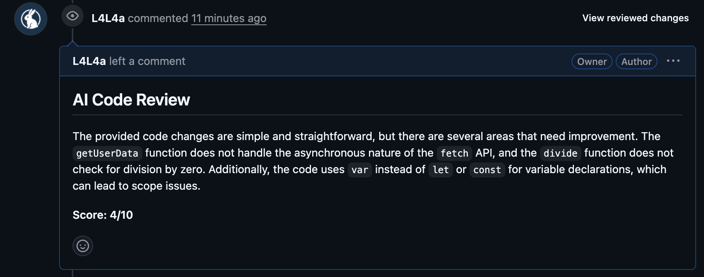
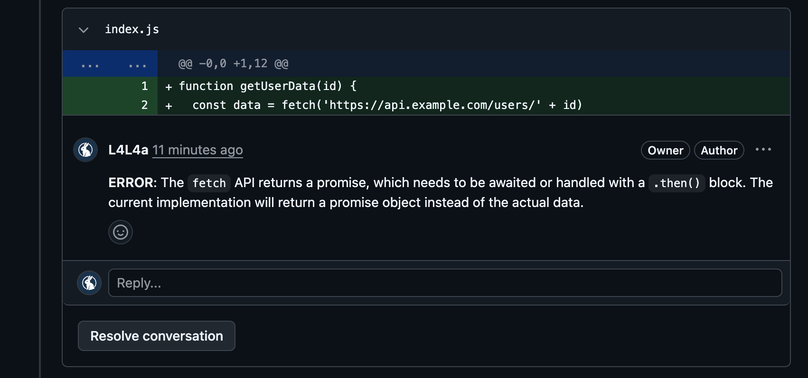

# AI Code Reviewer

<div align="center">

**A GitHub bot that reviews your pull requests automatically using AI.**
Catches bugs, flags bad patterns, and posts inline comments with severity ratings — the moment a PR is opened.

[](https://nodejs.org)
[](https://typescriptlang.org)
[](https://expressjs.com)
[](https://groq.com)
[](https://render.com)

</div>

---

## Demo

### Review summary posted on the PR



### Inline comment on the exact line with the bug



---

## What it does

Most code review bottlenecks happen because reviewers are busy. This bot never is.

The moment a developer opens or updates a pull request, the bot:

1. Receives a signed webhook from GitHub
2. Verifies the HMAC-SHA256 signature to confirm it's genuine
3. Fetches the PR diff from the GitHub API
4. Parses it into structured file and line data
5. Sends it to Groq's Llama 3.3 70B model for analysis
6. Posts a full review back to the PR — a summary, a score out of 10, and inline comments on specific lines with `ERROR`, `WARNING`, or `INFO` severity

---

## Architecture

```
Developer opens PR
        │
        ▼
GitHub fires webhook
        │
        ▼
Express server receives POST /webhook
        │
   Verify HMAC-SHA256 signature
        │
   ┌────┴────┐
Invalid     Valid
   │           │
401         Parse webhook payload
            │
            ├── action: closed → ignore
            │
            └── action: opened / synchronize / reopened
                        │
                        ▼
                Fetch PR diff
                (GitHub Octokit API)
                        │
                        ▼
                Parse raw diff
                into structured
                FileDiff objects
                        │
                        ▼
                Send to Groq API
                (Llama 3.3 70B)
                        │
                        ▼
                Parse JSON response
                with fallback handling
                        │
                        ▼
                Post inline review
                comments to PR ✓
```

---

## Tech stack

| Layer | Technology | Why |
|---|---|---|
| Runtime | Node.js 24 + TypeScript | Type safety catches bugs at compile time |
| Server | Express | Lightweight, perfect for webhook handling |
| AI | Groq API — Llama 3.3 70B | Fast inference, generous free tier |
| GitHub | Octokit REST | Official GitHub API client |
| Security | HMAC-SHA256 + timingSafeEqual | Verifies webhooks are genuine, prevents timing attacks |
| Deployment | Render | Free tier, auto-deploys on push |

---

## Key engineering decisions

**Why HMAC signature verification?**
Anyone can send a POST request to a public webhook endpoint. GitHub signs every request with a shared secret using SHA-256. The server recomputes the hash and compares with `crypto.timingSafeEqual` — preventing both spoofed requests and timing attacks. This is a real production security pattern.

**Why respond to GitHub before processing?**
GitHub expects a response within 10 seconds or it marks the delivery as failed. The server responds with `200` immediately, then runs the review asynchronously. This decouples the HTTP response from the AI processing time.

**Why parse the diff into structured objects?**
Raw git diffs are noisy — they contain file headers, hunk markers (`@@`), and context lines mixed in with actual changes. Parsing them into `FileDiff` and `DiffLine` objects with explicit `added | removed | context` types means the AI only sees clean, structured data — improving review quality and reducing token usage.

**Why a fallback on AI response parsing?**
AI models sometimes return malformed JSON or wrap it in markdown code fences. The `parseReviewResponse` function strips those, attempts JSON parsing, and falls back to returning the raw text as the summary rather than crashing. The server should never go down because of an unexpected AI response format.

---

## Project structure

```
ai-code-reviewer/
├── src/
│   ├── types.ts        # Core interfaces — WebhookPayload, ReviewComment, ReviewResult
│   ├── parser.ts       # Git diff parser — raw diff → structured FileDiff objects
│   ├── github.ts       # GitHub API — fetch diffs, post review comments
│   ├── reviewer.ts     # Groq AI integration — prompt engineering + response parsing
│   └── server.ts       # Express server — webhook handling + HMAC verification
├── screenshots/
│   ├── review-summary.png
│   └── review-comment.png
├── .env.example
├── .gitignore
├── package.json
└── tsconfig.json
```

---

## Local setup

### Prerequisites

- Node.js 18+
- [GitHub Personal Access Token](https://github.com/settings/tokens) — `repo` scope
- [Groq API Key](https://console.groq.com) — free, no credit card needed
- A GitHub repo to install the webhook on

### Installation

```bash
git clone https://github.com/L4L4a/ai-code-reviewer
cd ai-code-reviewer
npm install
```

### Environment variables

Create a `.env` file:

```bash
GITHUB_TOKEN=ghp_your_token_here
GITHUB_WEBHOOK_SECRET=any_random_string_you_pick
GROQ_API_KEY=gsk_your_groq_key_here
PORT=3000
```

### Run locally

```bash
npm run dev
```

To receive webhooks locally, expose your server with [ngrok](https://ngrok.com):

```bash
ngrok http 3000
```

Use the ngrok URL as your webhook payload URL.

---

## GitHub webhook setup

1. Go to your repo → **Settings** → **Webhooks** → **Add webhook**
2. **Payload URL:** your server URL + `/webhook`
3. **Content type:** `application/json`
4. **Secret:** your `GITHUB_WEBHOOK_SECRET` value
5. **Events:** select **Pull requests** only
6. Click **Add webhook**

---

## Deployment

Deployed on [Render](https://render.com) free tier with auto-deploy on every push to `main`.

| Setting | Value |
|---|---|
| Build command | `npm install && npx tsc` |
| Start command | `node dist/server.js` |
| Environment | Set your 4 env vars in the Render dashboard |

---

## What the bot reviews

- Missing `async/await` on promise-based calls
- Use of `var` instead of `let` or `const`
- Missing error handling (division by zero, null checks)
- Security concerns in changed code
- General code quality and readability

Each comment includes a severity — **ERROR**, **WARNING**, or **INFO** — so developers know what needs immediate attention versus what's a suggestion.

---

<div align="center">

Built by [Elvis Kenneth](https://github.com/L4L4a) · [Live Demo](https://ai-code-reviewer-py6i.onrender.com)

</div>